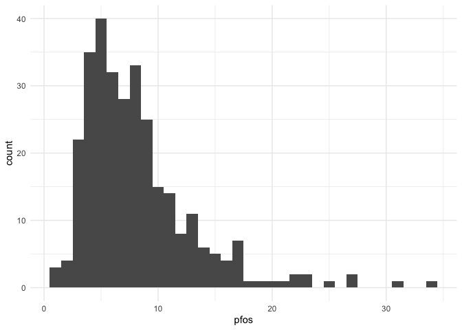
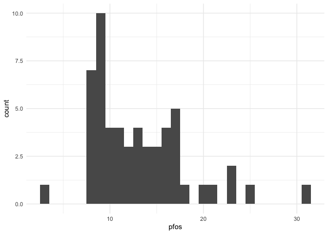
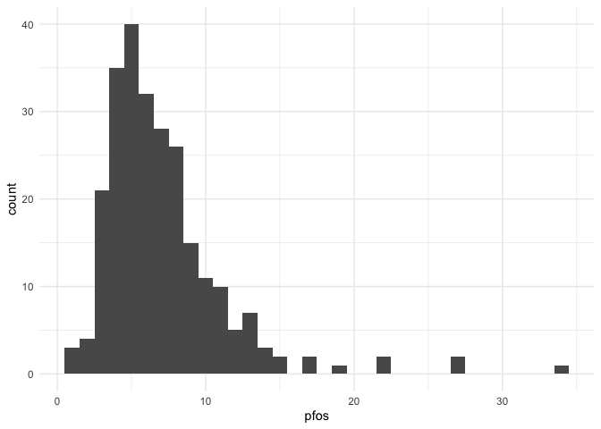
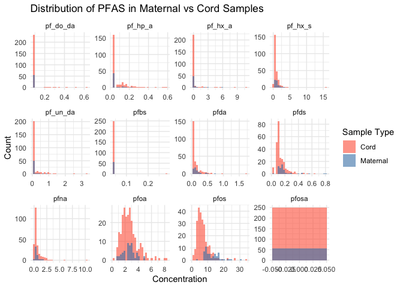
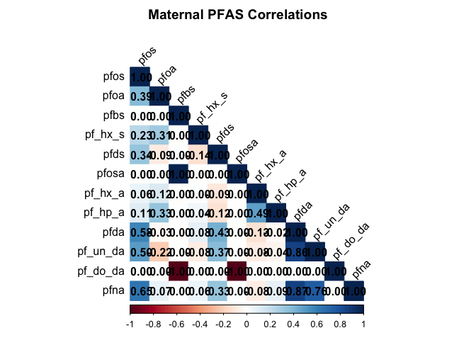
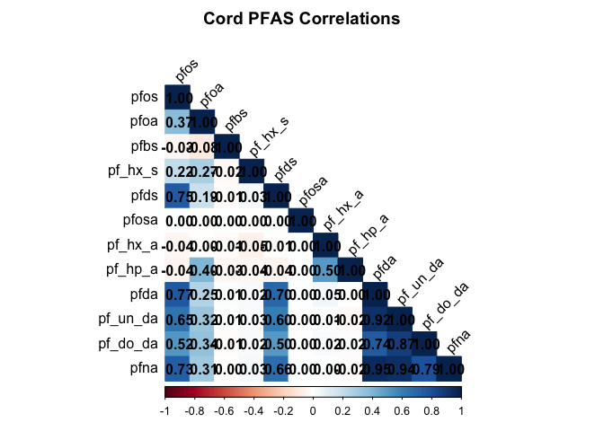
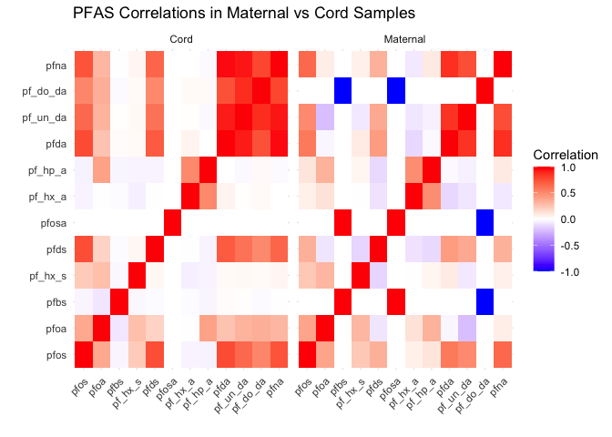
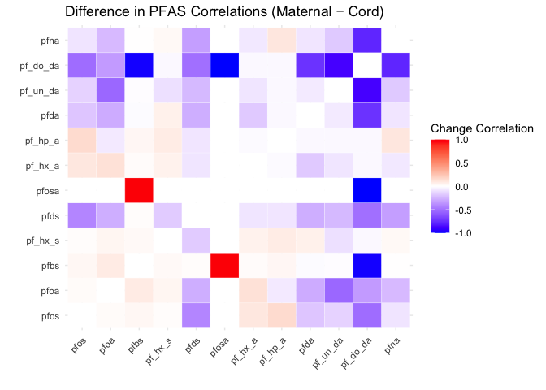

pfas
================

``` r
pfas_df = read_excel("./data/wtc_pfas_results.xlsx",
          sheet = "PFAAs",
          skip = 4, 
          col_names = TRUE) |> 
  janitor::clean_names() |> 
  mutate(
    pfos = ifelse(pfos == "<LOQ", 0.10, pfos),
    pfoa = ifelse(pfoa == "<LOQ", 0.04, pfoa),
    pfbs = ifelse(pfbs == "<LOQ", 0.04, pfbs),
    pf_hx_s = ifelse(pf_hx_s == "<LOQ", 0.04, pf_hx_s),
    pfds = ifelse(pfds == "<LOQ", 0.04, pfds),
    pfosa = ifelse(pfosa == "<LOQ", 0.04, pfosa),
    pf_hx_a = ifelse(pf_hx_a == "<LOQ", 0.04, pf_hx_a),
    pf_hp_a = ifelse(pf_hp_a == "<LOQ", 0.04, pf_hp_a),
    pfda = ifelse(pfda == "<LOQ", 0.04, pfda),
    pf_un_da = ifelse(pf_un_da == "<LOQ", 0.10, pf_un_da),
    pf_do_da = ifelse(pf_do_da == "<LOQ", 0.10, pf_do_da),
    pfna = ifelse(pfna == "<LOQ", 0.10, pfna)
  ) |>
  mutate(across(pfos:pfna, as.numeric)) |> 
  rename(sid = subject_id)
```

    ## New names:
    ## • `` -> `...1`

``` r
pfas_df = pfas_df[1:(nrow(pfas_df) - 4), ]
view(pfas_df)

write_csv(pfas_df, "wtc_pfas.csv")
```

``` r
maternal_df = pfas_df |> 
  filter(startsWith(as.character(sid), "1")) |> 
  mutate(sid = as.numeric(sid) %% 1000)
```

    ## Warning: There was 1 warning in `mutate()`.
    ## ℹ In argument: `sid = as.numeric(sid)%%1000`.
    ## Caused by warning:
    ## ! NAs introduced by coercion

``` r
view(maternal_df)

cord_df = pfas_df |> 
  filter(startsWith(as.character(sid), "2")) |> 
  mutate(sid = as.numeric(sid) %% 1000)
view(cord_df)
```

``` r
summary(pfas_df[ , c("pfos", "pfoa", "pfbs", "pf_hx_s", "pfds", "pfosa", "pf_hx_a", "pf_hp_a", "pfda", "pf_un_da", "pf_do_da", "pfna")])
```

    ##       pfos             pfoa             pfbs            pf_hx_s       
    ##  Min.   : 1.053   Min.   :0.1834   Min.   :0.04000   Min.   : 0.0400  
    ##  1st Qu.: 4.741   1st Qu.:1.8170   1st Qu.:0.04000   1st Qu.: 0.4880  
    ##  Median : 7.061   Median :2.4730   Median :0.04000   Median : 0.7080  
    ##  Mean   : 8.142   Mean   :2.6418   Mean   :0.04079   Mean   : 0.9102  
    ##  3rd Qu.: 9.861   3rd Qu.:3.2170   3rd Qu.:0.04000   3rd Qu.: 1.0160  
    ##  Max.   :33.701   Max.   :8.1410   Max.   :0.28128   Max.   :15.7640  
    ##       pfds            pfosa         pf_hx_a           pf_hp_a       
    ##  Min.   :0.0400   Min.   :0.04   Min.   : 0.0400   Min.   :0.04000  
    ##  1st Qu.:0.0964   1st Qu.:0.04   1st Qu.: 0.0400   1st Qu.:0.04000  
    ##  Median :0.1156   Median :0.04   Median : 0.0400   Median :0.04000  
    ##  Mean   :0.1518   Mean   :0.04   Mean   : 0.2874   Mean   :0.08699  
    ##  3rd Qu.:0.1688   3rd Qu.:0.04   3rd Qu.: 0.0400   3rd Qu.:0.11289  
    ##  Max.   :0.8160   Max.   :0.04   Max.   :10.8074   Max.   :0.58689  
    ##       pfda           pf_un_da         pf_do_da           pfna        
    ##  Min.   :0.0400   Min.   :0.1000   Min.   :0.1000   Min.   : 0.1000  
    ##  1st Qu.:0.0400   1st Qu.:0.1000   1st Qu.:0.1000   1st Qu.: 0.2541  
    ##  Median :0.0400   Median :0.1000   Median :0.1000   Median : 0.3805  
    ##  Mean   :0.1284   Mean   :0.1963   Mean   :0.1120   Mean   : 0.6377  
    ##  3rd Qu.:0.1592   3rd Qu.:0.1000   3rd Qu.:0.1000   3rd Qu.: 0.7165  
    ##  Max.   :1.6924   Max.   :3.2702   Max.   :0.6312   Max.   :10.3405

``` r
summary(maternal_df[ , c("pfos", "pfoa", "pfbs", "pf_hx_s", "pfds", "pfosa", "pf_hx_a", "pf_hp_a", "pfda", "pf_un_da", "pf_do_da", "pfna")])
```

    ##       pfos             pfoa            pfbs         pf_hx_s     
    ##  Min.   : 2.901   Min.   :0.881   Min.   :0.04   Min.   :0.352  
    ##  1st Qu.: 9.141   1st Qu.:1.951   1st Qu.:0.04   1st Qu.:0.666  
    ##  Median :11.581   Median :2.713   Median :0.04   Median :0.928  
    ##  Mean   :12.967   Mean   :2.644   Mean   :0.04   Mean   :1.050  
    ##  3rd Qu.:16.121   3rd Qu.:3.021   3rd Qu.:0.04   3rd Qu.:1.294  
    ##  Max.   :30.901   Max.   :5.061   Max.   :0.04   Max.   :3.196  
    ##       pfds            pfosa         pf_hx_a          pf_hp_a       
    ##  Min.   :0.0400   Min.   :0.04   Min.   :0.0400   Min.   :0.04000  
    ##  1st Qu.:0.1238   1st Qu.:0.04   1st Qu.:0.0400   1st Qu.:0.04000  
    ##  Median :0.1592   Median :0.04   Median :0.0400   Median :0.04000  
    ##  Mean   :0.2017   Mean   :0.04   Mean   :0.2805   Mean   :0.06302  
    ##  3rd Qu.:0.1884   3rd Qu.:0.04   3rd Qu.:0.0400   3rd Qu.:0.04000  
    ##  Max.   :0.8160   Max.   :0.04   Max.   :6.0074   Max.   :0.22929  
    ##       pfda           pf_un_da         pf_do_da        pfna       
    ##  Min.   :0.0400   Min.   :0.1000   Min.   :0.1   Min.   :0.1000  
    ##  1st Qu.:0.0616   1st Qu.:0.1000   1st Qu.:0.1   1st Qu.:0.2965  
    ##  Median :0.1204   Median :0.1000   Median :0.1   Median :0.4445  
    ##  Mean   :0.1527   Mean   :0.1409   Mean   :0.1   Mean   :0.5271  
    ##  3rd Qu.:0.1862   3rd Qu.:0.1000   3rd Qu.:0.1   3rd Qu.:0.5805  
    ##  Max.   :0.7524   Max.   :0.8262   Max.   :0.1   Max.   :1.9325

``` r
summary(cord_df[ , c("pfos", "pfoa", "pfbs", "pf_hx_s", "pfds", "pfosa", "pf_hx_a", "pf_hp_a", "pfda", "pf_un_da", "pf_do_da", "pfna")])
```

    ##       pfos             pfoa             pfbs            pf_hx_s       
    ##  Min.   : 1.053   Min.   :0.1834   Min.   :0.04000   Min.   : 0.0400  
    ##  1st Qu.: 4.411   1st Qu.:1.7950   1st Qu.:0.04000   1st Qu.: 0.4720  
    ##  Median : 6.181   Median :2.4370   Median :0.04000   Median : 0.6580  
    ##  Mean   : 7.081   Mean   :2.6413   Mean   :0.04097   Mean   : 0.8793  
    ##  3rd Qu.: 8.381   3rd Qu.:3.2290   3rd Qu.:0.04000   3rd Qu.: 0.8960  
    ##  Max.   :33.701   Max.   :8.1410   Max.   :0.28128   Max.   :15.7640  
    ##       pfds            pfosa         pf_hx_a           pf_hp_a       
    ##  Min.   :0.0400   Min.   :0.04   Min.   : 0.0400   Min.   :0.04000  
    ##  1st Qu.:0.0944   1st Qu.:0.04   1st Qu.: 0.0400   1st Qu.:0.04000  
    ##  Median :0.1094   Median :0.04   Median : 0.0400   Median :0.04000  
    ##  Mean   :0.1409   Mean   :0.04   Mean   : 0.2889   Mean   :0.09227  
    ##  3rd Qu.:0.1610   3rd Qu.:0.04   3rd Qu.: 0.0400   3rd Qu.:0.12409  
    ##  Max.   :0.6440   Max.   :0.04   Max.   :10.8074   Max.   :0.58689  
    ##       pfda           pf_un_da         pf_do_da           pfna        
    ##  Min.   :0.0400   Min.   :0.1000   Min.   :0.1000   Min.   : 0.1000  
    ##  1st Qu.:0.0400   1st Qu.:0.1000   1st Qu.:0.1000   1st Qu.: 0.2428  
    ##  Median :0.0400   Median :0.1000   Median :0.1000   Median : 0.3765  
    ##  Mean   :0.1230   Mean   :0.2084   Mean   :0.1147   Mean   : 0.6620  
    ##  3rd Qu.:0.1436   3rd Qu.:0.1000   3rd Qu.:0.1000   3rd Qu.: 0.7295  
    ##  Max.   :1.6924   Max.   :3.2702   Max.   :0.6312   Max.   :10.3405

``` r
ggplot(pfas_df, aes(x = pfos)) +
  geom_histogram(binwidth = 1) +
  theme_minimal()
```

<!-- -->

``` r
ggplot(maternal_df, aes(x = pfos)) +
  geom_histogram(binwidth = 1) +
  theme_minimal()
```

<!-- -->

``` r
ggplot(cord_df, aes(x = pfos)) +
  geom_histogram(binwidth = 1) +
  theme_minimal()
```

<!-- -->

``` r
maternal_df = maternal_df |> 
  mutate(sample_type = "Maternal")
cord_df = cord_df |> 
  mutate(sample_type = "Cord")
```

``` r
combined_df = bind_rows(maternal_df, cord_df)
```

``` r
pfas_long = combined_df |> 
  pivot_longer(cols = pfos:pfna, 
               names_to = "pfas", 
               values_to = "concentration")
```

``` r
ggplot(pfas_long, aes(x = concentration, fill = sample_type)) +
  geom_histogram(position = "identity", alpha = 0.6, bins = 30) +
  facet_wrap(~pfas, scales = "free") +
  scale_fill_manual(values = c("Maternal" = "steelblue", "Cord" = "tomato")) +
  theme_minimal() +
  labs(x = "Concentration", y = "Count", fill = "Sample Type",
       title = "Distribution of PFAS in Maternal vs Cord Samples")
```

<!-- -->

``` r
demographic_df = read_csv("./data/wtc_demographic.csv") |> 
  janitor::clean_names() |> 
  mutate(sid = sid %% 1000)
```

    ## New names:
    ## Rows: 329 Columns: 23
    ## ── Column specification
    ## ──────────────────────────────────────────────────────── Delimiter: "," dbl
    ## (22): ...1, sid, sid_new, hosp, DaysSinceWTC, GA_days, gender, c_sectio... date
    ## (1): child_DOB
    ## ℹ Use `spec()` to retrieve the full column specification for this data. ℹ
    ## Specify the column types or set `show_col_types = FALSE` to quiet this message.
    ## • `` -> `...1`

``` r
view(demographic_df)
```

``` r
lipids_df = read_excel("./data/lipids.xls",
            sheet = "Final Data",
            skip = 1, 
            col_names = TRUE) |> 
  janitor::clean_names() |> 
  mutate(sample_id = as.numeric(sub("^T", "", sample_id))) |> 
  mutate(sample_id = sample_id %% 1000) |> 
  rename(sid = sample_id) |> 
  drop_na()

view(lipids_df)
```

``` r
pfas_df = pfas_df |>
  mutate(sid = as.numeric(sid))
```

    ## Warning: There was 1 warning in `mutate()`.
    ## ℹ In argument: `sid = as.numeric(sid)`.
    ## Caused by warning:
    ## ! NAs introduced by coercion

``` r
demographic_df = demographic_df |>
  mutate(sid = as.numeric(sid))

merged_df = demographic_df |> 
  inner_join(lipids_df, by = "sid")
view(merged_df)
```

Correlation Matrix

``` r
# Select only PFAS numeric columns
pfas_vars = c("pfos", "pfoa", "pfbs", "pf_hx_s", "pfds", "pfosa",
               "pf_hx_a", "pf_hp_a", "pfda", "pf_un_da", "pf_do_da", "pfna")

# Maternal correlation matrix
maternal_cor = cor(maternal_df[, pfas_vars], use = "pairwise.complete.obs", method = "pearson")
view(maternal_cor)

# Cord correlation matrix
cord_cor = cor(cord_df[, pfas_vars], use = "pairwise.complete.obs", method = "pearson")
view(cord_cor)
```

``` r
library(corrplot)
```

    ## corrplot 0.95 loaded

``` r
corrplot(maternal_cor, method = "color", type = "lower",
         addCoef.col = "black", tl.col = "black", tl.srt = 45,
         title = "Maternal PFAS Correlations", mar = c(0,0,2,0))
```

<!-- -->

``` r
corrplot(cord_cor, method = "color", type = "lower",
         addCoef.col = "black", tl.col = "black", tl.srt = 45,
         title = "Cord PFAS Correlations", mar = c(0,0,2,0))
```

<!-- -->

``` r
library(dplyr)
library(tidyr)

combined_cor = combined_df |>
  select(sample_type, all_of(pfas_vars)) |>
  group_by(sample_type) |>
  summarise(across(everything(), ~list(.)), .groups = "drop") |>
  rowwise() |>
  mutate(cor_matrix = list(cor(as.data.frame(across(where(is.list), ~ unlist(.))),
                               use = "pairwise.complete.obs"))) |>
  select(sample_type, cor_matrix)
```

Heatmap

``` r
pfas_vars <- c("pfos", "pfoa", "pfbs", "pf_hx_s", "pfds", "pfosa",
               "pf_hx_a", "pf_hp_a", "pfda", "pf_un_da", "pf_do_da", "pfna")

maternal_cor <- cor(maternal_df[, pfas_vars], use = "pairwise.complete.obs")
cord_cor     <- cor(cord_df[, pfas_vars], use = "pairwise.complete.obs")
```

``` r
library(reshape2)
```

    ## 
    ## Attaching package: 'reshape2'

    ## The following object is masked from 'package:tidyr':
    ## 
    ##     smiths

``` r
library(dplyr)

maternal_long <- melt(maternal_cor) |> 
  mutate(sample_type = "Maternal")

cord_long <- melt(cord_cor) |> 
  mutate(sample_type = "Cord")

cor_long <- bind_rows(maternal_long, cord_long)
```

``` r
library(ggplot2)

ggplot(cor_long, aes(x = Var1, y = Var2, fill = value)) +
  geom_tile() +
  scale_fill_gradient2(low = "blue", mid = "white", high = "red",
                       midpoint = 0, limit = c(-1, 1)) +
  facet_wrap(~sample_type) +
  theme_minimal() +
  theme(axis.text.x = element_text(angle = 45, vjust = 1, hjust = 1)) +
  labs(title = "PFAS Correlations in Maternal vs Cord Samples",
       x = "", y = "", fill = "Correlation")
```

<!-- -->

``` r
pfas_vars <- c("pfos", "pfoa", "pfbs", "pf_hx_s", "pfds", "pfosa",
               "pf_hx_a", "pf_hp_a", "pfda", "pf_un_da", "pf_do_da", "pfna")

maternal_cor <- cor(maternal_df[, pfas_vars], use = "pairwise.complete.obs")
cord_cor     <- cor(cord_df[, pfas_vars], use = "pairwise.complete.obs")

# Difference (Maternal minus Cord)
diff_cor <- maternal_cor - cord_cor

library(reshape2)
diff_long <- melt(diff_cor)

library(ggplot2)

ggplot(diff_long, aes(x = Var1, y = Var2, fill = value)) +
  geom_tile(color = "white") +
  scale_fill_gradient2(low = "blue", mid = "white", high = "red",
                       midpoint = 0, limit = c(-1, 1)) +
  theme_minimal() +
  theme(axis.text.x = element_text(angle = 45, vjust = 1, hjust = 1)) +
  labs(title = "Difference in PFAS Correlations (Maternal − Cord)",
       x = "", y = "", fill = "Change Correlation")
```

<!-- --> Red represents
strong correlations in maternal samples, blue represents strong
correlations in cord samples, and white is similar in both.
