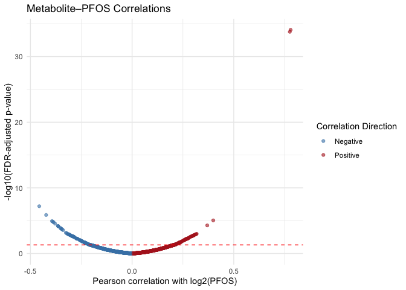
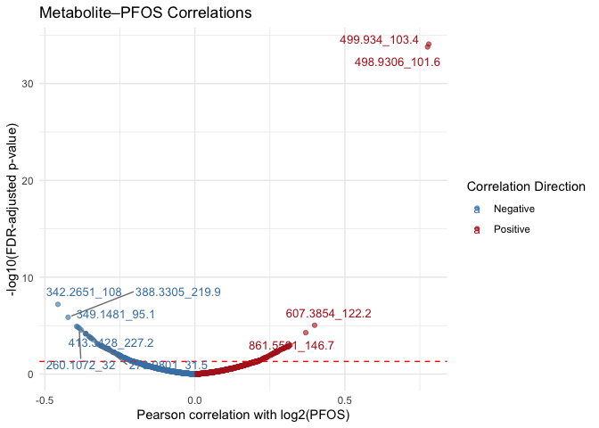
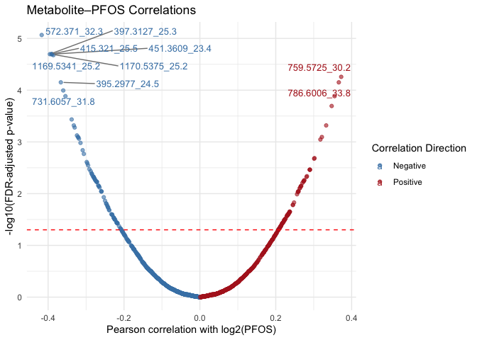

pfasxuntargeted
================

``` r
library(tidyverse)
```

    ## ── Attaching core tidyverse packages ──────────────────────── tidyverse 2.0.0 ──
    ## ✔ dplyr     1.1.4     ✔ readr     2.1.5
    ## ✔ forcats   1.0.0     ✔ stringr   1.5.1
    ## ✔ ggplot2   3.5.1     ✔ tibble    3.2.1
    ## ✔ lubridate 1.9.4     ✔ tidyr     1.3.1
    ## ✔ purrr     1.0.2     
    ## ── Conflicts ────────────────────────────────────────── tidyverse_conflicts() ──
    ## ✖ dplyr::filter() masks stats::filter()
    ## ✖ dplyr::lag()    masks stats::lag()
    ## ℹ Use the conflicted package (<http://conflicted.r-lib.org/>) to force all conflicts to become errors

``` r
library(readxl)
library(matrixStats)
```

    ## 
    ## Attaching package: 'matrixStats'
    ## 
    ## The following object is masked from 'package:dplyr':
    ## 
    ##     count

``` r
library(janitor)
```

    ## 
    ## Attaching package: 'janitor'
    ## 
    ## The following objects are masked from 'package:stats':
    ## 
    ##     chisq.test, fisher.test

``` r
#  Load metabolomics data
c18_lipids = read_tsv("./data/c18_lipids.txt") |> clean_names()
```

    ## New names:
    ## Rows: 5818 Columns: 651
    ## ── Column specification
    ## ──────────────────────────────────────────────────────── Delimiter: "\t" chr
    ## (6): MatchCategory...1, MatchCategory...3, LM_ID, Name, Formula, Adduct dbl
    ## (645): mz, theoretical.mz, MonoisotopicMass, AdductMass, time, mz.min, m...
    ## ℹ Use `spec()` to retrieve the full column specification for this data. ℹ
    ## Specify the column types or set `show_col_types = FALSE` to quiet this message.
    ## • `MatchCategory` -> `MatchCategory...1`
    ## • `MatchCategory` -> `MatchCategory...3`

``` r
# Replace zeros and NAs for log transformation
replace_zero = function(x) {
  x[x == 0 | is.na(x)] = min(x[x > 0], na.rm = TRUE)/2
  x
}

intensity_cols = grep("^sd_", colnames(c18_lipids), value = TRUE)
intensity_mat = c18_lipids |>
  select(all_of(intensity_cols)) |>
  mutate(across(everything(), replace_zero)) |>
  as.matrix()
```

``` r
# Log-transform intensities
log_intensity = log2(intensity_mat)
```

``` r
# Feature-level stats: rsd

feature_rsd = rowSds(log_intensity, na.rm = TRUE) / rowMeans(log_intensity, na.rm = TRUE)
presence = rowSums(!is.na(intensity_mat))
keep_features = (feature_rsd < 0.5) & (presence >= 0.5 * ncol(intensity_mat))

X = log_intensity[keep_features, , drop = FALSE]
feature_ids = c18_lipids$lm_id[keep_features]
```

``` r
# Filter features: rsd < 0.5 and present in >50% samples
feature_var = rowVars(X, na.rm = TRUE)
X = X[feature_var > 1e-6, , drop = FALSE]
feature_ids = feature_ids[feature_var > 1e-6]
```

``` r
# Load PFAS exposure data
pfas_df = read_excel("./data/wtc_pfas_results.xlsx", sheet = "PFAAs", skip = 4) |> 
  clean_names() |> 
  mutate(across(pfos:pfna, ~ ifelse(. == "<LOQ", 0.04, as.numeric(.)))) |> 
  slice(1:(n() - 4)) |>   # remove extra rows
  dplyr::select(subject_id, pfos, pfoa) |> 
  mutate(ID = paste0("T", subject_id))
```

    ## New names:
    ## • `` -> `...1`

    ## Warning: There were 9 warnings in `mutate()`.
    ## The first warning was:
    ## ℹ In argument: `across(pfos:pfna, ~ifelse(. == "<LOQ", 0.04, as.numeric(.)))`.
    ## Caused by warning in `ifelse()`:
    ## ! NAs introduced by coercion
    ## ℹ Run `dplyr::last_dplyr_warnings()` to see the 8 remaining warnings.

``` r
c18_script = read_csv("./data/c18_70detect_log2.csv")
```

    ## Rows: 544 Columns: 1607
    ## ── Column specification ────────────────────────────────────────────────────────
    ## Delimiter: ","
    ## chr    (2): ID, File Name
    ## dbl (1605): 100.004_273.2, 100.004_29.7, 101.0243_254.2, 101.0356_198.5, 102...
    ## 
    ## ℹ Use `spec()` to retrieve the full column specification for this data.
    ## ℹ Specify the column types or set `show_col_types = FALSE` to quiet this message.

``` r
merged = inner_join(pfas_df, c18_script, by = "ID") |> 
  mutate(log2_pfos = log2(pfos)) |> 
  mutate(log2_pfoa = log2(pfoa))

view(merged)
```

Merging all PFAAs

``` r
#pfas_df = read_excel("./data/wtc_pfas_results.xlsx", sheet = "PFAAs", skip = 4) |> 
#  clean_names() |> 
#  mutate(across(pfos:pfna, ~ ifelse(. == "<LOQ", 0.04, as.numeric(.)))) |> 
#  slice(1:(n() - 4)) |>   # remove extra rows
#  dplyr::select(subject_id, pfos, pfoa, pfbs, pf_hx_s, pfds, pfosa, pf_hx_a, pf_hp_a, pfda, pf_un_da, pf_do_da, pfna) |> 
#  mutate(ID = paste0("T", subject_id))
```

``` r
#c18_script = read_csv("./data/c18_70detect_log2.csv")
#
#merged = inner_join(pfas_df, c18_script, by = "ID") |> 
#  mutate(log2_pfos = log2(pfos)) |> 
#  mutate(log2_pfoa = log2(pfoa))|> 
#  mutate(log2_pfbs = log2(pfbs))|> 
#  mutate(log2_pf_hx_s = log2(pf_hx_s))|> 
#  mutate(log2_pfds = log2(pfds))|> 
#  mutate(log2_pfosa = log2(pfosa))|> 
#  mutate(log2_pf_hx_a = log2(pf_hx_a))|> 
#  mutate(log2_pf_hp_a = log2(pf_hp_a))|> 
#  mutate(log2_pfda = log2(pfda))|> 
#  mutate(log2_pf_un_da = log2(pf_un_da))|> 
#  mutate(log2_pf_do_da = log2(pf_do_da))|> 
#  mutate(log2_pfna = log2(pfna))
#
#view(merged)
```

``` r
feature_names = names(c18_script)[-c(1:2)] # save the names of the features to subset the merged file

# Run multiple correlation tests using the map function from the purrr package ----
pfos_cor_test_results = merged |> 
    dplyr::select(all_of(feature_names)) |> 
    purrr::map(~cor.test(merged$log2_pfos, .x, method = "pearson"))

# Tidy the results (a list) into a dataframe using the tidy function from the broom package
pfos_cor_test_results_tidy = pfos_cor_test_results |> 
    map_df(~broom::tidy(.x)) |> 
    mutate(feature = feature_names) # add the names of the features
```

``` r
pfos_cor_test_results_tidy = pfos_cor_test_results_tidy |>
  mutate(p_adj = p.adjust(p.value, method = "BH"))
```

``` r
library(ggplot2)

pfos_cor_test_results_tidy |> 
  ggplot(aes(x = estimate, y = -log10(p_adj))) +
  geom_point(alpha = 0.6) +
  geom_hline(yintercept = -log10(0.05), color = "red", linetype = "dashed") +
  labs(
    x = "Pearson correlation with log2(PFOS)",
    y = "-log10(FDR-adjusted p-value)",
    title = "Metabolite–PFOS Correlations"
  ) +
  theme_minimal()
```

<!-- -->

``` r
pfos_cor_test_results_tidy |> 
  ggplot(aes(x = estimate, y = -log10(p_adj), color = estimate > 0)) +
  geom_point(alpha = 0.6) +
  geom_hline(yintercept = -log10(0.05), color = "red", linetype = "dashed") +
  scale_color_manual(values = c("TRUE" = "firebrick", "FALSE" = "steelblue"),
                     labels = c("Negative", "Positive")) +
  labs(
    x = "Pearson correlation with log2(PFOS)",
    y = "-log10(FDR-adjusted p-value)",
    title = "Metabolite–PFOS Correlations",
    color = "Correlation Direction"
  ) +
  theme_minimal()
```

<!-- -->

``` r
pfos_cor_test_results_tidy |>
  filter(p_adj < 0.05) |>
  arrange(desc(abs(estimate)))
```

    ## # A tibble: 170 × 10
    ##    estimate statistic  p.value parameter conf.low conf.high method   alternative
    ##       <dbl>     <dbl>    <dbl>     <int>    <dbl>     <dbl> <chr>    <chr>      
    ##  1    0.780     16.6  5.26e-38       178    0.715     0.831 Pearson… two.sided  
    ##  2    0.776     16.4  2.08e-37       178    0.710     0.828 Pearson… two.sided  
    ##  3   -0.457     -6.85 1.18e-10       178   -0.565    -0.332 Pearson… two.sided  
    ##  4   -0.423     -6.22 3.41e- 9       178   -0.536    -0.295 Pearson… two.sided  
    ##  5    0.399      5.81 2.84e- 8       178    0.269     0.515 Pearson… two.sided  
    ##  6   -0.394     -5.72 4.42e- 8       178   -0.511    -0.263 Pearson… two.sided  
    ##  7   -0.390     -5.65 6.20e- 8       178   -0.507    -0.259 Pearson… two.sided  
    ##  8   -0.386     -5.58 8.94e- 8       178   -0.504    -0.254 Pearson… two.sided  
    ##  9   -0.379     -5.46 1.60e- 7       178   -0.497    -0.246 Pearson… two.sided  
    ## 10    0.370      5.31 3.30e- 7       178    0.236     0.489 Pearson… two.sided  
    ## # ℹ 160 more rows
    ## # ℹ 2 more variables: feature <chr>, p_adj <dbl>

``` r
library(dplyr)

top_hits = pfos_cor_test_results_tidy |>
  filter(p_adj < 0.05) |>         
  arrange(p_adj) |>                
  slice_head(n = 10)                
```

``` r
library(ggplot2)
library(ggrepel)

pfos_cor_test_results_tidy |>
  ggplot(aes(x = estimate, y = -log10(p_adj), color = estimate > 0)) +
  geom_point(alpha = 0.6) +
  geom_hline(yintercept = -log10(0.05), color = "red", linetype = "dashed") +
  geom_text_repel(
    data = top_hits,
    aes(label = feature),
    size = 3.5,
    max.overlaps = 15,
    box.padding = 0.4,
    point.padding = 0.3,
    segment.color = "gray50"
  ) +
  scale_color_manual(
    values = c("TRUE" = "firebrick", "FALSE" = "steelblue"),
    labels = c("Negative", "Positive"),
    name = "Correlation Direction"
  ) +
  labs(
    x = "Pearson correlation with log2(PFOS)",
    y = "-log10(FDR-adjusted p-value)",
    title = "Metabolite–PFOS Correlations"
  ) +
  theme_minimal()
```

<!-- -->

``` r
# Load metabolomics data
hilic_lipids = read_tsv("./data/hilic_lipids.txt") |> clean_names()
```

    ## New names:
    ## Rows: 4892 Columns: 651
    ## ── Column specification
    ## ──────────────────────────────────────────────────────── Delimiter: "\t" chr
    ## (6): MatchCategory...1, MatchCategory...3, LM_ID, Name, Formula, Adduct dbl
    ## (645): mz, theoretical.mz, MonoisotopicMass, AdductMass, time, mz.min, m...
    ## ℹ Use `spec()` to retrieve the full column specification for this data. ℹ
    ## Specify the column types or set `show_col_types = FALSE` to quiet this message.
    ## • `MatchCategory` -> `MatchCategory...1`
    ## • `MatchCategory` -> `MatchCategory...3`

``` r
# Replace zeros and NAs for log transformation
replace_zero = function(x) {
  x[x == 0 | is.na(x)] = min(x[x > 0], na.rm = TRUE)/2
  x
}

intensity_cols = grep("^sd_", colnames(hilic_lipids), value = TRUE)
intensity_mat = hilic_lipids |>
  select(all_of(intensity_cols)) |>
  mutate(across(everything(), replace_zero)) |>
  as.matrix()
```

``` r
# Log-transform intensities
log_intensity = log2(intensity_mat)
```

``` r
# Feature-level stats: rsd

feature_rsd = rowSds(log_intensity, na.rm = TRUE) / rowMeans(log_intensity, na.rm = TRUE)
presence = rowSums(!is.na(intensity_mat))
keep_features = (feature_rsd < 0.5) & (presence >= 0.5 * ncol(intensity_mat))

X = log_intensity[keep_features, , drop = FALSE]
feature_ids = hilic_lipids$lm_id[keep_features]
```

``` r
# Filter features: rsd < 0.5 and present in >50% samples
feature_var = rowVars(X, na.rm = TRUE)
X = X[feature_var > 1e-6, , drop = FALSE]
feature_ids = feature_ids[feature_var > 1e-6]
```

``` r
# Load PFAS exposure data
pfas_df = read_excel("./data/wtc_pfas_results.xlsx", sheet = "PFAAs", skip = 4) |> 
  clean_names() |> 
  mutate(across(pfos:pfna, ~ ifelse(. == "<LOQ", 0.04, as.numeric(.)))) |> 
  slice(1:(n() - 4)) |>   # remove extra rows
  dplyr::select(subject_id, pfos, pfoa) |> 
  mutate(ID = paste0("T", subject_id))
```

    ## New names:
    ## • `` -> `...1`

    ## Warning: There were 9 warnings in `mutate()`.
    ## The first warning was:
    ## ℹ In argument: `across(pfos:pfna, ~ifelse(. == "<LOQ", 0.04, as.numeric(.)))`.
    ## Caused by warning in `ifelse()`:
    ## ! NAs introduced by coercion
    ## ℹ Run `dplyr::last_dplyr_warnings()` to see the 8 remaining warnings.

``` r
hilic_script = read_tsv("./data/hilic_70detect_log2.csv")
```

    ## Rows: 544 Columns: 1482
    ## ── Column specification ────────────────────────────────────────────────────────
    ## Delimiter: "\t"
    ## chr    (2): ID, File Name
    ## dbl (1480): 100.0756_37.8, 100.51_27.1, 100.51_282.6, 101.0709_103.7, 1010.2...
    ## 
    ## ℹ Use `spec()` to retrieve the full column specification for this data.
    ## ℹ Specify the column types or set `show_col_types = FALSE` to quiet this message.

``` r
hilic_merged = inner_join(pfas_df, hilic_script, by = "ID") |> 
  mutate(log2_pfos = log2(pfos)) |> 
  mutate(log2_pfoa = log2(pfoa))

view(hilic_merged)
```

``` r
feature_names = names(hilic_script)[-c(1:2)] # save the names of the features to subset the merged file

# Run multiple correlation tests using the map function from the purrr package ----
pfos_cor_test_results = hilic_merged |> 
    dplyr::select(all_of(feature_names)) |> 
    purrr::map(~cor.test(hilic_merged$log2_pfos, .x, method = "pearson"))

# Tidy the results (a list) into a dataframe using the tidy function from the broom package
pfos_cor_test_results_tidy = pfos_cor_test_results |> 
    map_df(~broom::tidy(.x)) |> 
    mutate(feature = feature_names) # add the names of the features
```

``` r
pfos_cor_test_results_tidy = pfos_cor_test_results_tidy |>
  mutate(p_adj = p.adjust(p.value, method = "BH"))
```

``` r
library(ggplot2)

pfos_cor_test_results_tidy |> 
  ggplot(aes(x = estimate, y = -log10(p_adj))) +
  geom_point(alpha = 0.6) +
  geom_hline(yintercept = -log10(0.05), color = "red", linetype = "dashed") +
  labs(
    x = "Pearson correlation with log2(PFOS)",
    y = "-log10(FDR-adjusted p-value)",
    title = "Metabolite–PFOS Correlations"
  ) +
  theme_minimal()
```

<!-- -->

``` r
pfos_cor_test_results_tidy |> 
  ggplot(aes(x = estimate, y = -log10(p_adj), color = estimate > 0)) +
  geom_point(alpha = 0.6) +
  geom_hline(yintercept = -log10(0.05), color = "red", linetype = "dashed") +
  scale_color_manual(values = c("TRUE" = "firebrick", "FALSE" = "steelblue"),
                     labels = c("Negative", "Positive")) +
  labs(
    x = "Pearson correlation with log2(PFOS)",
    y = "-log10(FDR-adjusted p-value)",
    title = "Metabolite–PFOS Correlations",
    color = "Correlation Direction"
  ) +
  theme_minimal()
```

<!-- -->

``` r
map_corr = pfos_cor_test_results_tidy |>
  filter(p_adj < 0.05) |>
  arrange(desc(abs(estimate)))
```

``` r
library(dplyr)

top_hits = pfos_cor_test_results_tidy |>
  filter(p_adj < 0.05) |>         
  arrange(p_adj) |>                
  slice_head(n = 10)                
```

``` r
library(ggplot2)
library(ggrepel)

pfos_cor_test_results_tidy |>
  ggplot(aes(x = estimate, y = -log10(p_adj), color = estimate > 0)) +
  geom_point(alpha = 0.6) +
  geom_hline(yintercept = -log10(0.05), color = "red", linetype = "dashed") +
  geom_text_repel(
    data = top_hits,
    aes(label = feature),
    size = 3.5,
    max.overlaps = 15,
    box.padding = 0.4,
    point.padding = 0.3,
    segment.color = "gray50"
  ) +
  scale_color_manual(
    values = c("TRUE" = "firebrick", "FALSE" = "steelblue"),
    labels = c("Negative", "Positive"),
    name = "Correlation Direction"
  ) +
  labs(
    x = "Pearson correlation with log2(PFOS)",
    y = "-log10(FDR-adjusted p-value)",
    title = "Metabolite–PFOS Correlations"
  ) +
  theme_minimal()
```

<!-- -->

``` r
ggplot(pfos_cor_test_results_tidy, aes(x = estimate, y = -log10(p_adj))) +
  geom_point() +
  geom_smooth(method = "lm", color = "red") +
  theme_bw()
```

    ## `geom_smooth()` using formula = 'y ~ x'

<!-- -->

Merging lipids and demographic data

``` r
##demographic_df <- read_csv("./data/wtc_demographic.csv") |> 
##  clean_names() |> 
##  mutate(sid = sid %% 1000)
##
##lipids_df <- read_excel("./data/lipids.xls",
##                        sheet = "Final Data",
##                        skip = 1, 
##                        col_names = TRUE) |> 
##  clean_names() |> 
##  mutate(
##    sample_id = as.numeric(sub("^T", "", sample_id)),
##    sample_id = sample_id %% 1000
##  ) |> 
##  rename(sid = sample_id) |> 
##  drop_na()
##
##
##demo_lipids <- left_join(lipids_df, demographic_df, by = ##"sid")
##
### align IDs with same numeric form
##merged_all <- merged |>
##  mutate(sid = as.numeric(sub("^T", "", ID)) %% 1000) |> 
##  left_join(demo_lipids, by = "sid")
##
##
##view(merged_all)
```

``` r
library(dplyr)
library(tidyr)

pfas_summary_long <- merged %>%
  summarise(
    across(c(pfos, pfoa, log2_pfos, log2_pfoa),
           list(
             n = ~sum(!is.na(.)),
             mean = ~mean(., na.rm = TRUE),
             sd = ~sd(., na.rm = TRUE),
             median = ~median(., na.rm = TRUE),
             min = ~min(., na.rm = TRUE),
             max = ~max(., na.rm = TRUE)
           ),
           .names = "{.col}_{.fn}")
  ) %>%
  pivot_longer(everything(),
               names_to = c("Variable", "Statistic"),
               names_sep = "_",
               values_to = "Value") %>%
  pivot_wider(names_from = Statistic, values_from = Value)
```

    ## Warning: Expected 2 pieces. Additional pieces discarded in 12 rows [13, 14, 15, 16, 17,
    ## 18, 19, 20, 21, 22, 23, 24].

    ## Warning: Values from `Value` are not uniquely identified; output will contain list-cols.
    ## • Use `values_fn = list` to suppress this warning.
    ## • Use `values_fn = {summary_fun}` to summarise duplicates.
    ## • Use the following dplyr code to identify duplicates.
    ##   {data} |>
    ##   dplyr::summarise(n = dplyr::n(), .by = c(Variable, Statistic)) |>
    ##   dplyr::filter(n > 1L)

``` r
pfas_summary_long
```

    ## # A tibble: 3 × 9
    ##   Variable n         mean      sd        median    min    max    pfos   pfoa  
    ##   <chr>    <list>    <list>    <list>    <list>    <list> <list> <list> <list>
    ## 1 pfos     <dbl [1]> <dbl [1]> <dbl [1]> <dbl [1]> <dbl>  <dbl>  <NULL> <NULL>
    ## 2 pfoa     <dbl [1]> <dbl [1]> <dbl [1]> <dbl [1]> <dbl>  <dbl>  <NULL> <NULL>
    ## 3 log2     <NULL>    <NULL>    <NULL>    <NULL>    <NULL> <NULL> <dbl>  <dbl>
